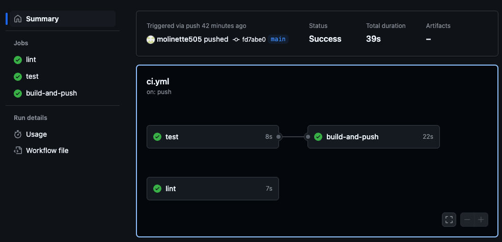
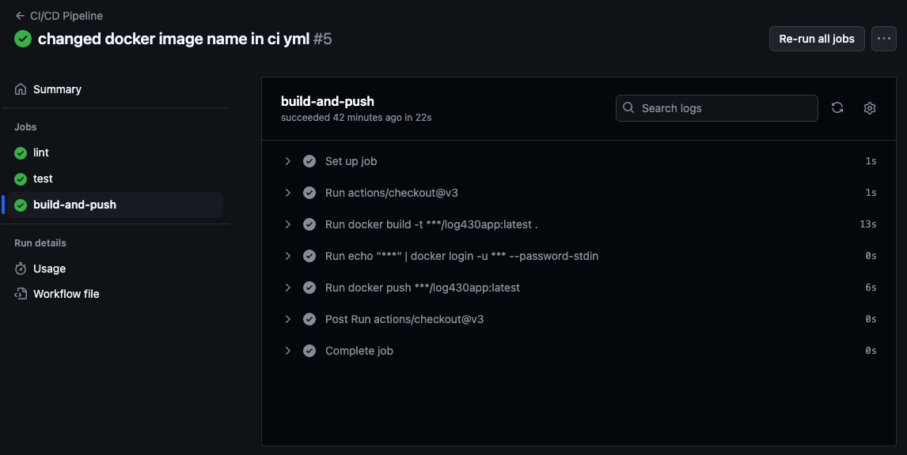
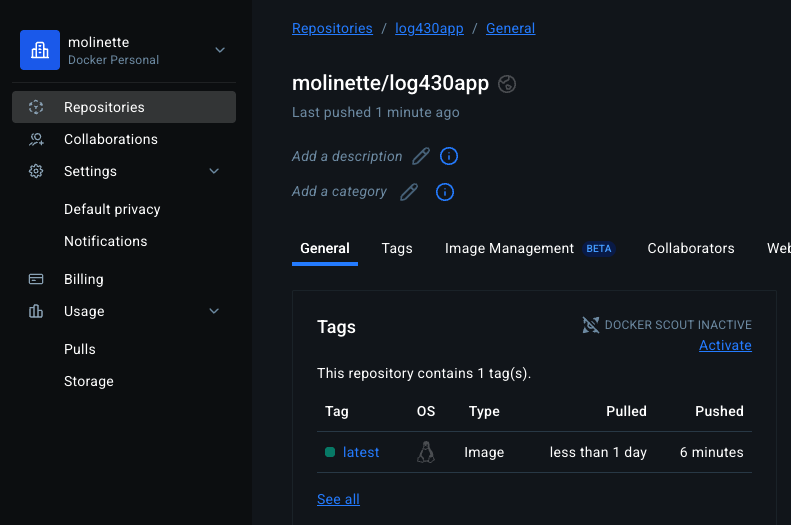

# Projet LOG430 – TP CI/CD

## Présentation du projet

Ce projet est une application Node.js minimaliste écrite en ECMAScript Modules (ESM), construite dans le cadre du TP de LOG430. Il comprend :

- Une API Express (`GET /`) qui retourne "Hello, World!"
- Des tests unitaires avec Jest
- Un linter avec ESLint (v9+)
- Une conteneurisation avec Docker
- Une intégration continue (CI/CD) avec GitHub Actions : lint, tests, build et push sur Docker Hub

---

## Structure du projet

```
.
├── src/
│   └── app.js                  # Code principal de l'application Express
├── tests/
│   ├── app.test.js             # Tests des routes Express
│   └── utils.test.js           # Tests des fonctions utilitaires
├── eslint.config.mjs           # Configuration ESLint
├── jest.config.mjs             # Configuration Jest
├── Dockerfile                  # Image Docker
├── docker-compose.yml          # Déploiement local avec Docker Compose
├── .dockerignore               # Fichiers exclus du build
├── .github/workflows/ci.yml    # Pipeline GitHub Actions
├── package.json                # Dépendances et scripts
└── README.md
```

---

## Installation et exécution

### Cloner le projet

```bash
git clone https://github.com/molinette505/LOG430mamonettemolina.git
cd LOG430mamonettemolina
npm install
```

---

## Exécution de l’application

### Sans Docker

```bash
npm run start
```

Application disponible sur : [http://localhost:3000](http://localhost:3000)

---

### Avec Docker

#### Build local

```bash
docker build -t log430app .
docker run -p 3000:3000 log430app
```

#### Exécution avec Docker Compose

```bash
docker compose up --build
```

## Tests

```bash
npm run test
```

⚠️ Pour les projets en ECMAScript Modules, Jest nécessite le flag `--experimental-vm-modules`, déjà intégré dans le script.

---

## Linter

```bash
npm run lint
```

---

## Intégration Continue (CI/CD)

Le pipeline GitHub Actions exécute automatiquement :

1. Le linting (`npm run lint`)
2. Les tests (`npm run test`)
3. Le build Docker
4. Le push vers Docker Hub : [`molinette/log430app:latest`](https://hub.docker.com/repository/docker/molinette/log430app)

🔗 [Voir les actions GitHub](https://github.com/molinette505/LOG430mamonettemolina/actions)

### Image d'une exécution réussie de la pipeline CI/CD
#### Résumé complet du pipeline GitHub Actions


#### Étape des tests automatisés (Jest)


#### Étape de build et push de l'image Docker


#### Image publiée automatiquement sur Docker Hub


---

## Auteur

**Marc-Alexandre Monette Molina**  
Projet LOG430 – ÉTS  
🔗 [Lien vers le projet GitHub](https://github.com/molinette505/LOG430mamonettemolina)
